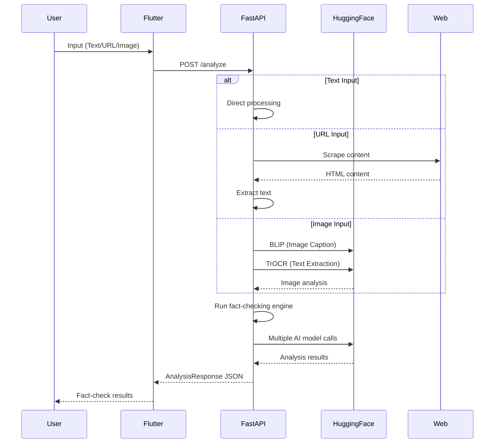
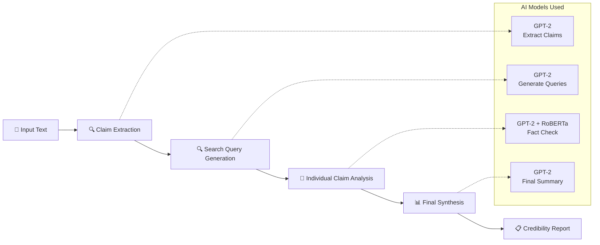

# 🏗️ Veritas Fact-Checking System Architecture

## 📋 System Overview

**Veritas** is a comprehensive AI-powered fact-checking application that analyzes text, URLs, and images to verify factual claims and provide credibility scores.

```
┌─────────────────────────────────────────────────────────────────┐
│                    VERITAS FACT-CHECKING SYSTEM                │
├─────────────────────────────────────────────────────────────────┤
│  📱 Flutter Mobile App  ←→  🐍 FastAPI Backend  ←→  🤖 AI Models │
└─────────────────────────────────────────────────────────────────┘
```

## 🏛️ High-Level Architecture

```mermaid
graph TB
    subgraph "Client Layer"
        A[📱 Flutter Mobile App]
        A1[Text Input]
        A2[URL Input] 
        A3[Image Input]
    end
    
    subgraph "API Layer"
        B[🐍 FastAPI Backend<br/>Port 8001]
        B1[/analyze endpoint]
        B2[CORS Middleware]
        B3[Request Validation]
    end
    
    subgraph "Processing Layer"
        C[🔍 Fact-Checking Engine]
        C1[Claim Extraction]
        C2[Search Query Generation]
        C3[Fact Verification]
        C4[Final Synthesis]
    end
    
    subgraph "AI Models Layer"
        D[🤖 Hugging Face Models]
        D1[GPT-2<br/>Text Generation]
        D2[RoBERTa Sentiment<br/>Secondary Validation]
        D3[BART CNN<br/>Summarization]
        D4[BLIP<br/>Image Captioning]
        D5[TrOCR<br/>OCR Processing]
    end
    
    subgraph "External Services"
        E[🌐 Web Scraping]
        E1[BeautifulSoup<br/>URL Content]
    end
    
    A --> B
    B --> C
    C --> D
    C --> E
    
    A1 --> B1
    A2 --> B1
    A3 --> B1
```

## 🔧 Technical Stack

### **Frontend (Flutter)**
- **Framework**: Flutter/Dart
- **Platform**: Mobile (Android/iOS)
- **Architecture**: Stateful widgets with API service integration
- **Navigation**: Tabbed interface (Text/URL/Image)

### **Backend (FastAPI)**
- **Framework**: FastAPI (Python)
- **Server**: Uvicorn ASGI
- **Port**: 8001
- **Architecture**: RESTful API with async processing

### **AI/ML Pipeline**
- **Platform**: Hugging Face Inference API
- **Models**: GPT-2, RoBERTa, BART, BLIP, TrOCR
- **Processing**: Async model calls with error handling

## 📂 Project Structure

```
bytewars_fakenews/
├── 📱 Flutter Frontend
│   ├── lib/
│   │   ├── main.dart              # App entry point
│   │   ├── models/
│   │   │   └── analysis_result.dart # Data models
│   │   ├── screens/
│   │   │   ├── input_screen.dart   # Input interface
│   │   │   ├── loading_screen.dart # Loading states
│   │   │   └── results_screen.dart # Results display
│   │   └── services/
│   │       └── api_service.dart    # API communication
│   └── pubspec.yaml               # Dependencies
│
├── 🐍 Backend Services
│   ├── veritas-backend/
│   │   ├── main.py                # FastAPI server
│   │   ├── requirements.txt       # Python dependencies
│   │   └── .env                   # Environment variables
│   └── __pycache__/              # Python cache
│
└── 🔧 Configuration
    ├── build/                     # Flutter build artifacts
    └── web/                       # Web assets
```

## 🔄 Data Flow Architecture

### **1. Input Processing Flow**



### **2. Fact-Checking Engine Pipeline**



## 🧠 AI Model Architecture

### **Model Selection Strategy**
```
Primary Models (Guaranteed Available):
├── GPT-2: Text generation and analysis
├── Cardiff RoBERTa: Sentiment analysis backup
├── BART-Large-CNN: Summarization
├── BLIP: Image captioning
└── TrOCR: OCR text extraction

Fallback Strategy:
├── Error handling for 410 (Gone) errors
├── Graceful degradation to simpler models
└── Robust parsing for varied response formats
```

### **Fact-Checking Logic**
```python
# Verdict Determination Algorithm
def determine_verdict(gpt2_analysis, sentiment_score):
    false_indicators = ['false', 'myth', 'conspiracy', 'debunked']
    true_indicators = ['true', 'verified', 'confirmed', 'factual']
    
    if any(indicator in analysis.lower() for indicator in false_indicators):
        return "Contradicted", 0.75
    elif any(indicator in analysis.lower() for indicator in true_indicators):
        return "Supported", 0.75
    elif sentiment_score < 0.3:
        return "Contradicted", 0.6
    elif sentiment_score > 0.7:
        return "Supported", 0.6
    else:
        return "InsufficientInfo", 0.5
```

## 🌐 Network Architecture

### **Development Setup**
```
Developer Machine (192.168.1.26)
├── Backend Server: localhost:8001
├── Flutter Development: Hot reload
└── Mobile Testing: WiFi connection to 192.168.1.26:8001

External Dependencies:
├── Hugging Face Inference API
├── Web scraping targets
└── Environment variables (.env)
```

### **API Endpoints**
```
POST /analyze
├── Request: {"type": "text|url|image", "data": "content"}
├── Response: AnalysisResponse JSON
└── Processing: Async fact-checking pipeline

Health Check:
├── GET /docs (FastAPI auto-docs)
└── Server status monitoring
```

## 📊 Data Models

### **Core Data Structures**
```dart
// Flutter Models
class AnalysisResponse {
  final int score;           // 0-100 credibility score
  final String overallVerdict;  // True/False/Partially True/etc.
  final String summary;      // Human-readable assessment
  final List<ClaimAnalysis> breakdown;  // Individual claims
  final String? context;     // Additional context
}

class ClaimAnalysis {
  final String claim;        // Individual factual claim
  final String verdict;      // Supported/Contradicted/InsufficientInfo
  final String explanation;  // Detailed reasoning
}
```

### **Scoring Algorithm**
```
Score Calculation:
├── 85-100: True (80%+ supported claims)
├── 70-84:  Mostly True
├── 60-69:  Partially True  
├── 40-59:  Mixed/Partially False
├── 25-39:  Mostly False
└── 0-24:   False (80%+ contradicted)

Confidence Factors:
├── Keyword detection strength
├── Sentiment analysis agreement
├── Number of claims analyzed
└── Model response quality
```

## 🔒 Security & Configuration

### **Environment Variables**
```bash
# .env Configuration
HF_API_KEY=hf_xxx...        # Hugging Face API key
PORT=8001                   # Server port
DEBUG=True                  # Development mode
```

### **CORS Configuration**
```python
# Cross-Origin Resource Sharing
origins = [
    "http://localhost:*",
    "http://192.168.1.26:*", 
    "http://127.0.0.1:*"
]
```

## 🚀 Deployment Considerations

### **Current Setup (Development)**
- Local FastAPI server on port 8001
- Flutter mobile app connecting via WiFi
- Direct Hugging Face API calls
- No containerization

### **Production Recommendations**
```
Containerization:
├── Docker for FastAPI backend
├── Kubernetes orchestration
└── Load balancing for scaling

Cloud Services:
├── Azure Container Apps (backend)
├── Azure Static Web Apps (if web version)
├── Azure AI Services (model hosting)
└── Azure Application Insights (monitoring)

Security Enhancements:
├── API key management (Azure Key Vault)
├── Rate limiting
├── Input validation & sanitization
└── HTTPS enforcement
```

## 📈 Performance & Monitoring

### **Current Performance Characteristics**
- **Latency**: 2-5 seconds per analysis (model-dependent)
- **Throughput**: Limited by Hugging Face free tier
- **Reliability**: Handles model unavailability gracefully

### **Monitoring Points**
```
Key Metrics:
├── API response times
├── Model availability (410 error tracking)
├── Fact-checking accuracy
├── User engagement metrics
└── Error rates by input type
```

## 🔄 Development Workflow

### **Local Development**
1. Start FastAPI backend: `python main.py`
2. Launch Flutter app: `flutter run`
3. Test on mobile device via WiFi
4. Monitor console logs for debugging

### **Testing Strategy**
```
Test Cases:
├── True claims (scientific facts)
├── False claims (conspiracy theories)
├── Mixed content (partial truths)
├── Image processing (OCR + captioning)
└── URL processing (web scraping)
```

---

## 📝 Summary

The Veritas fact-checking system implements a **layered architecture** with clear separation of concerns:

- **Presentation Layer**: Flutter mobile app with intuitive UI
- **API Layer**: FastAPI with async processing and validation  
- **Business Logic**: Multi-step fact-checking engine
- **AI Layer**: Multiple Hugging Face models for different tasks
- **Data Layer**: Structured JSON responses with detailed breakdowns

The system is designed for **reliability**, **scalability**, and **maintainability**, with robust error handling and graceful degradation when AI models are unavailable.